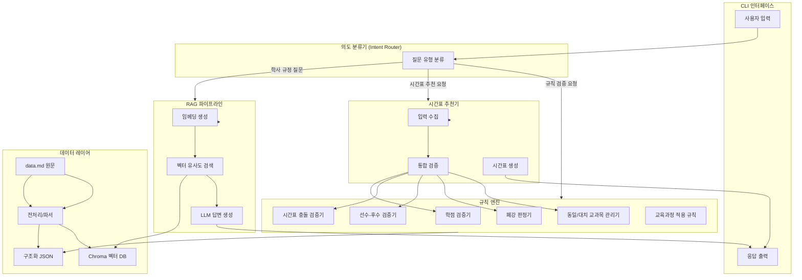
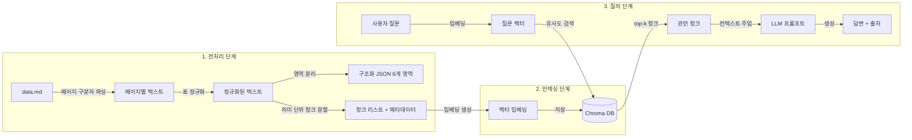
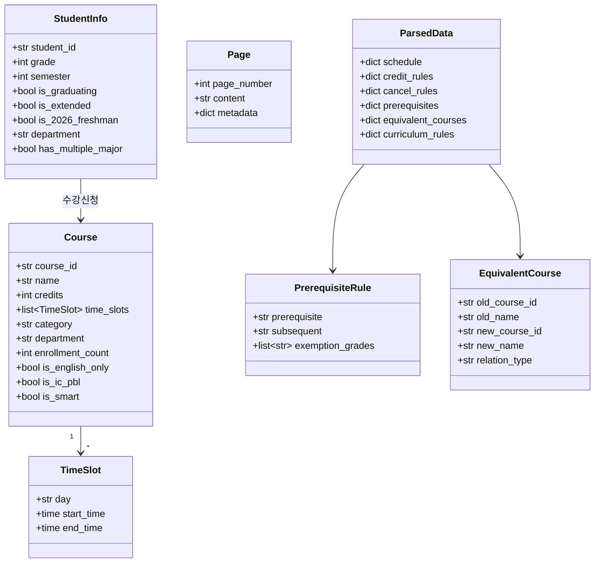

# 설계 문서: 한양대 서울캠퍼스 시간표 추천 챗봇

## 개요 (Overview)

한양대학교 서울캠퍼스 2026-1학기 학사안내 원문(data.md)을 기반으로, 학생이 자연어로 학사 규정을 질문하고 개인 맞춤형 시간표 추천을 받을 수 있는 RAG 기반 CLI 챗봇 시스템을 설계한다.

시스템은 크게 세 가지 핵심 기능을 제공한다:
1. **학사 규정 Q&A**: data.md를 청크 분할 → 임베딩 → 벡터 DB 저장 후, 사용자 질문에 대해 관련 청크를 검색하여 LLM이 근거 기반 답변을 생성
2. **규칙 기반 검증**: 학점 제한, 시간표 충돌, 선수-후수 관계, 폐강 위험, 동일/대치 교과목 등을 구조화된 데이터와 규칙 엔진으로 검증
3. **시간표 추천**: 사용자 입력(학번, 학년, 학과, 이수 현황, 희망 과목)을 기반으로 모든 검증을 통합 수행한 뒤 충돌 없는 최적 시간표를 생성

### 기술 스택
- **언어**: Python 3.11+
- **RAG 프레임워크**: LangChain
- **벡터 DB**: Chroma (로컬 persistent storage)
- **임베딩 모델**: OpenAI text-embedding-3-small (또는 HuggingFace 로컬 모델)
- **LLM**: OpenAI GPT-4o (API 키 기반)
- **CLI**: Python 표준 입출력 + rich 라이브러리 (테이블 출력)
- **환경변수 관리**: python-dotenv (.env)

### 설계 원칙
- **근거 기반 답변**: LLM은 검색된 청크 내용만을 근거로 답변하며, 근거 없는 내용은 "해당 정보를 찾을 수 없습니다"로 응답
- **규칙 엔진 분리**: 학점 검증, 폐강 판정 등 명확한 규칙은 LLM에 의존하지 않고 Python 코드로 구현
- **멱등성**: 동일 입력에 대해 동일 결과를 보장 (특히 데이터 파싱)
- **모듈화**: 각 검증기/판정기를 독립 모듈로 분리하여 테스트 용이성 확보

## 아키텍처 (Architecture)

### High-Level Architecture



### Low-Level Architecture: 데이터 흐름




## 컴포넌트 및 인터페이스 (Components and Interfaces)

### 1. 전처리 모듈 (`preprocessor.py`)

data.md 원문을 구조화된 데이터로 변환하는 모듈.

```python
class PageParser:
    """페이지 구분자 기반 파싱"""
    def parse_pages(self, raw_text: str) -> list[Page]
    # "--- 페이지 N ---" 패턴으로 분리, 각 Page에 page_number 메타데이터 부여

class TableNormalizer:
    """깨진 표 형식 데이터 정규화"""
    def normalize(self, raw_table: str) -> list[dict]
    # 불규칙한 행/열 구조를 일관된 키-값 dict 리스트로 변환

class DataParser:
    """영역별 구조화 JSON 생성"""
    def parse(self, pages: list[Page]) -> ParsedData
    # 6개 영역으로 분리: schedule, credit_rules, cancel_rules,
    #   prerequisites, equivalent_courses, curriculum_rules

class PreprocessorWarning:
    """인식 불가 데이터 경고"""
    page_number: int
    line_number: int
    message: str
```

**출력 JSON 구조 (ParsedData)**:
```json
{
  "schedule": { "수강신청_일정": [...], "수강정정_일정": [...], "수강포기_일정": {...} },
  "credit_rules": {
    "기본규칙": { "1-1_to_4-1": {"min": 10, "max": 20}, "4-2": {"min": 3, "max": 20}, "9학기이상": {"min": 1} },
    "추가학점": { "커리어개발_사회봉사_군사학": {"max_extra": 2}, "다전공_타전공_일반선택": {"max_extra": 3} },
    "2026신입생규칙": { "1-1_to_2-2": {"min": 10, "max": 20}, "3-1_to_4-1_건축학부제외": {"max": 18} }
  },
  "cancel_rules": { "일반기준": [...], "별도기준": [...] },
  "prerequisites": { "기초학술영어_전문학술영어": {...}, ... },
  "equivalent_courses": { "동일교과목": [...], "대치교과목": [...] },
  "curriculum_rules": { "4년단위_적용원칙": {...}, "학적변동_규칙": {...} }
}
```

### 2. 학점 검증기 (`credit_validator.py`)

```python
@dataclass
class StudentInfo:
    student_id: str        # 학번 (예: "2024012345")
    grade: int             # 학년 (1~5)
    semester: int          # 학기 (1 or 2)
    is_graduating: bool    # 졸업예정 여부
    is_extended: bool      # 학업연장재수강자 여부 (9학기 이상)
    is_2026_freshman: bool # 2026학년도 신입생 여부
    department: str        # 소속 학과
    has_multiple_major: bool  # 다중전공 여부

@dataclass
class CreditValidationResult:
    is_valid: bool
    min_credits: int
    max_credits: int
    current_credits: int
    extra_credits: int     # 추가 인정 학점
    warnings: list[str]

class CreditValidator:
    def __init__(self, credit_rules: dict): ...

    def validate(self, student: StudentInfo, courses: list[Course]) -> CreditValidationResult:
        """학점 범위 검증 수행"""

    def _calculate_max_credits(self, student: StudentInfo, courses: list[Course]) -> int:
        """기본 최대학점 + 추가학점 계산"""

    def _calculate_min_credits(self, student: StudentInfo) -> int:
        """학기별 최소학점 반환"""
```

### 3. 시간표 충돌 검증기 (`conflict_checker.py`)

```python
@dataclass
class TimeSlot:
    day: str          # "월", "화", "수", "목", "금"
    start_time: time  # 시작 시간
    end_time: time    # 종료 시간

@dataclass
class Course:
    course_id: str
    name: str
    credits: int
    time_slots: list[TimeSlot]
    category: str          # "전공필수", "교양필수", "핵심교양" 등
    department: str
    enrollment_count: int  # 수강신청 인원
    is_english_only: bool
    is_ic_pbl: bool
    is_smart: bool         # 스마트 교과(e-러닝 등)

@dataclass
class ConflictResult:
    has_conflict: bool
    conflicts: list[tuple[Course, Course, TimeSlot]]  # (과목A, 과목B, 겹치는 시간)

class ConflictChecker:
    def check_all_pairs(self, courses: list[Course]) -> ConflictResult:
        """모든 과목 쌍의 시간 충돌 검사"""

    def _is_overlapping(self, slot_a: TimeSlot, slot_b: TimeSlot) -> bool:
        """두 시간대가 1분이라도 겹치는지 판정"""

    def find_conflict_free_combinations(self, courses: list[Course]) -> list[list[Course]]:
        """충돌 없는 과목 조합 탐색 (백트래킹)"""

    def suggest_minimal_removal(self, courses: list[Course]) -> list[Course]:
        """충돌 최소화를 위해 제외할 과목 안내"""
```

### 4. 선수-후수 검증기 (`prerequisite_checker.py`)

```python
@dataclass
class PrerequisiteRule:
    prerequisite: str      # 선수과목명
    subsequent: str        # 후수과목명
    exemption_grades: list[str]  # 면제 등급 (예: ["A", "B"])

class PrerequisiteChecker:
    def __init__(self, rules: list[PrerequisiteRule]): ...

    def check(self, desired_courses: list[str], completed_courses: list[str],
              english_grade: str | None = None) -> list[PrerequisiteWarning]:
        """선수과목 미이수 경고 목록 반환"""

@dataclass
class PrerequisiteWarning:
    course_name: str           # 신청하려는 후수과목
    missing_prerequisite: str  # 미이수 선수과목
    message: str
```

### 5. 폐강 판정기 (`cancellation_checker.py`)

```python
@dataclass
class DepartmentInfo:
    name: str
    enrollment_by_grade: dict[int, int]  # {학년: 재학인원}

@dataclass
class CancellationResult:
    is_at_risk: bool
    reason: str
    applied_rule: str  # "일반기준" 또는 "별도기준"

class CancellationChecker:
    def __init__(self, cancel_rules: dict): ...

    def check(self, course: Course, department: DepartmentInfo) -> CancellationResult:
        """폐강 위험 여부 판정"""

    def _is_special_exempt(self, course: Course) -> bool:
        """별도기준 대상 여부 확인 (커리어개발, 종합설계, 캡스톤디자인 등)"""

    def _apply_general_rule(self, course: Course, dept: DepartmentInfo) -> CancellationResult:
        """일반기준 적용: 재학인원 구간별 폐강 기준"""
```

### 6. 동일/대치 교과목 관리기 (`equivalent_manager.py`)

```python
@dataclass
class EquivalentCourse:
    old_course_id: str
    old_name: str
    new_course_id: str
    new_name: str
    relation_type: str  # "동일" 또는 "대치"

class EquivalentManager:
    def __init__(self, equivalents: list[EquivalentCourse]): ...

    def check(self, desired_course: str, completed_courses: list[str]) -> EquivalentAdvice | None:
        """동일/대치 관계 확인 및 안내 메시지 반환"""

@dataclass
class EquivalentAdvice:
    course_name: str
    related_course: str
    relation_type: str
    message: str  # "동일 교과목이므로 재수강으로만 신청 가능" 등
```

### 7. 교육과정 적용 규칙 (`curriculum_advisor.py`)

```python
class CurriculumAdvisor:
    def __init__(self, curriculum_rules: dict): ...

    def get_curriculum(self, student: StudentInfo) -> str:
        """학번/학년 기반 적용 교육과정 반환 (예: "2024-2027")"""

    def get_curriculum_changes(self, student: StudentInfo,
                                leave_history: list[dict]) -> list[str]:
        """휴·복학 이력에 따른 교육과정 변동 사항 안내"""
```

### 8. RAG 파이프라인 (`rag_pipeline.py`)

```python
class RAGPipeline:
    def __init__(self, vector_db_path: str, llm_model: str): ...

    def index(self, pages: list[Page]) -> None:
        """페이지를 의미 단위 청크로 분할 → 임베딩 → Chroma 저장"""

    def query(self, question: str, top_k: int = 5) -> RAGResponse:
        """질문에 대해 관련 청크 검색 → LLM 답변 생성"""

@dataclass
class RAGResponse:
    answer: str
    sources: list[ChunkSource]  # 참조 청크 출처 (페이지 번호)
    has_evidence: bool          # 근거 존재 여부

@dataclass
class ChunkSource:
    page_number: int
    chunk_text: str
    similarity_score: float
```

### 9. 시간표 추천기 (`schedule_recommender.py`)

```python
class ScheduleRecommender:
    def __init__(self, credit_validator, conflict_checker,
                 prerequisite_checker, cancellation_checker,
                 equivalent_manager): ...

    def recommend(self, student: StudentInfo, completed_courses: list[str],
                  desired_courses: list[Course],
                  english_grade: str | None = None) -> ScheduleResult:
        """통합 검증 후 추천 시간표 생성"""

@dataclass
class ScheduleResult:
    timetable: list[list[str]]  # 요일×교시 2D 배열
    warnings: list[str]         # 경고 메시지 (폐강 위험, 선수과목 미이수 등)
    credit_info: CreditValidationResult
    conflicts: ConflictResult
```

### 10. 의도 분류기 및 CLI (`chatbot.py`)

```python
class IntentRouter:
    """사용자 입력의 의도를 분류"""
    def classify(self, user_input: str) -> Intent

class Intent(Enum):
    REGULATION_QA = "regulation_qa"       # 학사 규정 질문
    SCHEDULE_RECOMMEND = "schedule"       # 시간표 추천
    SCHEDULE_INFO = "schedule_info"       # 수강신청 일정 조회
    CREDIT_CHECK = "credit_check"        # 학점 확인
    DROP_CHECK = "drop_check"            # 수강포기 가능 여부
    RETAKE_INFO = "retake_info"          # 성적상승재수강 안내

class ChatBot:
    def __init__(self, rag_pipeline, schedule_recommender, ...): ...

    def run(self) -> None:
        """CLI 메인 루프"""

    def handle_input(self, user_input: str) -> str:
        """의도 분류 → 적절한 핸들러 호출 → 응답 반환"""
```


## 데이터 모델 (Data Models)

### 핵심 데이터 모델



### 구조화 JSON 스키마

#### 1. 수강신청 일정 (`schedule`)
```json
{
  "수강신청_일정": [
    {
      "대상": "4,5학년",
      "일자": "2026-02-09",
      "요일": "월",
      "시작시간": "11:00",
      "종료시간": "24:00",
      "비고": "온라인 선착순 수강신청"
    }
  ],
  "수강정정_일정": [...],
  "수강포기_일정": {
    "시작": "2026-03-23T09:00",
    "종료": "2026-03-24T24:00",
    "제한": ["학사학위취득유예자", "의과대학 의학과"]
  }
}
```

#### 2. 학점 제한 규칙 (`credit_rules`)
```json
{
  "기본규칙_2025이전입학": {
    "1-1_to_4-1": { "min": 10, "max": 20 },
    "4-2_졸업예정": { "min": 3, "max": 20 },
    "9학기이상_학업연장": { "min": 1 }
  },
  "기본규칙_2026신입생": {
    "1-1_to_2-2": { "min": 10, "max": 20 },
    "3-1_to_4-1_건축학부제외": { "min": 10, "max": 18 },
    "4-2_졸업예정": { "min": 3, "max": 18 }
  },
  "추가학점규칙": {
    "커리어개발_사회봉사_군사학": { "max_extra": 2, "대상과목": ["커리어개발Ⅰ", "커리어개발Ⅱ", "사회봉사", "군사학"] },
    "다전공_타전공_일반선택": { "max_extra": 3 },
    "일반물리학및실험1_일반화학및실험1": { "extra_per_course": 1 }
  }
}
```

#### 3. 폐강 기준 (`cancel_rules`)
```json
{
  "일반기준": [
    { "조건": "학년별_재학인원_25명이상_일반교과목", "폐강기준": "수강인원_10명미만" },
    { "조건": "핵심교양", "폐강기준": "수강인원_10명미만" },
    { "조건": "학년별_재학인원_15_24명_일반교과목", "폐강기준": "재학인원_40퍼센트미만" },
    { "조건": "학년별_재학인원_14명이하", "폐강기준": "수강인원_6명미만" },
    { "조건": "전공심화_스마트교과", "폐강기준": "수강인원_6명미만" },
    { "조건": "영어전용_제2외국어전용", "폐강기준": "수강인원_8명미만" },
    { "조건": "IC-PBL", "폐강기준": "수강인원_8명미만" }
  ],
  "별도기준_면제대상": [
    "커리어개발Ⅰ", "커리어개발Ⅱ", "종합설계", "캡스톤디자인",
    "실용공학연구", "사회봉사", "교직", "연구실현장실습",
    "실용연구심화", "핵심교양_가상대학영역", "ROTC"
  ]
}
```

#### 4. 선수-후수 관계 (`prerequisites`)
```json
{
  "rules": [
    {
      "prerequisite": "기초학술영어",
      "subsequent": "전문학술영어",
      "exemption": {
        "condition": "영어기초학력평가",
        "exempt_grades": ["A", "B"],
        "description": "A등급: 기초+전문 면제, B등급: 기초 면제"
      }
    }
  ]
}
```

#### 5. 동일/대치 교과목 (`equivalent_courses`)
```json
{
  "동일교과목": [
    { "old_id": "DIS1025", "old_name": "Basic Quantitative Methods", "new_id": "FUT1007", "new_name": "데이터과학트렌드" }
  ],
  "대치교과목": [
    { "old_id": "D-C2033", "old_name": "무대기술", "new_id": "D-C1025", "new_name": "디자인실습1" }
  ]
}
```

#### 6. 교육과정 적용 규칙 (`curriculum_rules`)
```json
{
  "4년단위_적용원칙": {
    "2020-2023": { "입학년도": [2020, 2021, 2022, 2023] },
    "2024-2027": { "입학년도": [2024, 2025, 2026, 2027] }
  },
  "2026년_적용": {
    "1-3학년": "2024-2027",
    "4-5학년_건축학부": "2020-2023_전공"
  },
  "학적변동_규칙": "복학 등 학적변동 발생 시, 학적변동 이후 학년·학기에 해당하는 교육과정 적용"
}
```

### 벡터 DB 청크 스키마

```json
{
  "id": "chunk_001",
  "text": "수강신청 가능학점 ... (청크 내용)",
  "metadata": {
    "page_number": 10,
    "section": "수강신청_유의사항",
    "source": "data.md"
  },
  "embedding": [0.012, -0.034, ...]
}
```


## 정확성 속성 (Correctness Properties)

*정확성 속성(property)이란 시스템의 모든 유효한 실행에서 참이어야 하는 특성 또는 동작을 의미한다. 이는 사람이 읽을 수 있는 명세와 기계가 검증할 수 있는 정확성 보장 사이의 다리 역할을 한다.*

### Property 1: 파싱 멱등성 (Idempotent Parsing)

*임의의* 유효한 data.md 텍스트에 대해, 동일한 입력을 두 번 파싱하면 두 결과 JSON이 동일해야 한다. 즉, `parse(text) == parse(text)`가 항상 성립한다.

**Validates: Requirements 1.4**

### Property 2: 페이지 구분자 파싱 정확성

*임의의* "--- 페이지 N ---" 형식의 구분자가 포함된 텍스트에 대해, 파싱 결과의 각 청크에 부여된 페이지 번호는 해당 구분자의 N 값과 일치해야 하며, 청크 수는 구분자 수와 일치해야 한다.

**Validates: Requirements 1.1**

### Property 3: 인식 불가 데이터 경고 포함 정보

*임의의* 인식 불가능한 형식의 데이터가 포함된 입력에 대해, 전처리 스크립트가 생성하는 경고 로그에는 반드시 페이지 번호와 라인 번호 정보가 포함되어야 한다.

**Validates: Requirements 1.5**

### Property 4: 학기/상태별 학점 범위 적용

*임의의* 학생 정보(학년, 학기, 졸업예정 여부, 학업연장 여부, 2026 신입생 여부)에 대해, 학점 검증기가 반환하는 최소/최대 학점 범위는 다음 규칙과 일치해야 한다:
- 1-1~4-1학기(비신입생): min=10, max=20
- 졸업예정(4-2): min=3, max=20
- 학업연장재수강자(9학기 이상): min=1
- 2026 신입생 1~2학년: min=10, max=20
- 2026 신입생 3학년 이상(건축학부 제외): max=18

**Validates: Requirements 2.1, 2.2, 2.3, 2.6, 2.7**

### Property 5: 추가학점 상한 준수

*임의의* 학생과 과목 조합에 대해, 커리어개발Ⅰ/Ⅱ/사회봉사/군사학에 의한 추가학점은 2학점을 초과하지 않으며, 다전공자의 타전공 일반선택에 의한 추가학점은 3학점을 초과하지 않아야 한다.

**Validates: Requirements 2.4, 2.5**

### Property 6: 학점 범위 위반 경고 생성

*임의의* 학생 정보와 과목 리스트에 대해, 총 수강학점이 최소학점 미만이거나 최대학점을 초과하면, 검증 결과의 `is_valid`는 False이고 `warnings`에 "학점 범위 위반" 메시지와 허용 범위가 포함되어야 한다.

**Validates: Requirements 2.8**

### Property 7: 시간 충돌 판정 정확성

*임의의* 두 과목의 TimeSlot에 대해, 두 시간대가 동일 요일이고 `start_a < end_b AND start_b < end_a`이면 충돌로 판정되어야 하며, 그렇지 않으면 충돌이 아니어야 한다. (1분이라도 겹치면 충돌)

**Validates: Requirements 3.1, 3.2**

### Property 8: 선수과목 미이수 경고

*임의의* 선수-후수 관계 규칙과 이수 현황에 대해, 후수과목이 희망 과목에 포함되고 해당 선수과목이 이수 현황에 없으면(면제 조건 미충족 시), 경고 목록에 해당 후수과목과 미이수 선수과목 정보가 포함되어야 한다.

**Validates: Requirements 4.2**

### Property 9: 폐강 판정 일반기준 적용

*임의의* 과목과 학과 정보에 대해(별도기준 비대상), 폐강 판정기는 학과 재학인원 구간에 따라 올바른 폐강 기준을 적용해야 한다:
- 재학인원 25명 이상 + 일반교과목/핵심교양: 수강인원 10명 미만이면 폐강 위험
- 재학인원 15~24명 + 일반교과목: 수강인원이 재학인원의 40% 미만이면 폐강 위험
- 재학인원 14명 이하 또는 전공심화 스마트교과: 수강인원 6명 미만이면 폐강 위험
- 영어전용/제2외국어전용/IC-PBL: 수강인원 8명 미만이면 폐강 위험

**Validates: Requirements 5.1, 5.2, 5.3, 5.4**

### Property 10: 폐강 판정 별도기준 우선 적용

*임의의* 별도기준 대상 과목(커리어개발, 종합설계, 캡스톤디자인, 사회봉사, 교직, ROTC 등)에 대해, 수강인원과 무관하게 폐강 위험은 항상 False여야 한다. 일반기준과 별도기준 모두 부합하는 과목에 대해서도 별도기준이 우선 적용되어 폐강 위험은 False여야 한다.

**Validates: Requirements 5.5, 5.6**

### Property 11: 동일/대치 교과목 안내 정확성

*임의의* 이수 과목과 신청 과목 쌍에 대해, 동일 교과목 관계이면 "재수강으로만 신청 가능" 안내를, 대치 교과목 관계이면 "재수강 또는 일반수강 선택 가능" 안내를 반환해야 하며, 관계가 없으면 None을 반환해야 한다.

**Validates: Requirements 6.2, 6.3**

### Property 12: 교육과정 적용 규칙 정확성

*임의의* 학번과 학년에 대해, 4년 단위 교육과정 적용 원칙에 따라 올바른 교육과정이 반환되어야 한다. 2026학년도 기준 1~3학년은 "2024-2027", 4~5학년(건축학부)은 "2020-2023"이 반환되어야 한다.

**Validates: Requirements 7.1, 7.3**

### Property 13: 청크 메타데이터 보존

*임의의* 페이지 데이터에 대해, 벡터 DB에 저장된 청크의 메타데이터에는 원본 페이지 번호가 포함되어야 하며, RAG 응답의 sources에도 해당 페이지 번호가 포함되어야 한다.

**Validates: Requirements 8.1, 8.3**

### Property 14: 시간표 추천 통합 검증 수행

*임의의* 학생 정보와 희망 과목에 대해, 시간표 추천기는 학점 검증, 시간 충돌 검증, 선수-후수 검증, 폐강 위험 판정을 모두 수행해야 하며, 추천 결과에 각 검증 결과가 포함되어야 한다.

**Validates: Requirements 9.1**

### Property 15: 시간표 경고 표시 완전성

*임의의* 추천 시간표에 대해, 폐강 위험 과목이 포함되면 "폐강 위험" 경고가, 선수과목 미이수 과목이 포함되면 "선수과목 미이수 경고"가 warnings 목록에 포함되어야 한다.

**Validates: Requirements 9.3, 9.4**

### Property 16: 수강포기 가능 여부 검증

*임의의* 학생과 포기 대상 과목에 대해, 수강포기 후 잔여학점이 최소학점 미만이면 포기 불가, 포기 과목이 2과목을 초과하면 포기 불가, 학사학위취득유예자이면 포기 불가로 판정되어야 한다.

**Validates: Requirements 9.5**

### Property 17: 수강신청 일정 조회 정확성

*임의의* 유효한 학년(1~5)에 대해, 수강신청 일정 조회 결과에는 해당 학년의 수강신청 날짜와 시간 정보가 포함되어야 하며, 빈 결과를 반환하지 않아야 한다.

**Validates: Requirements 10.5**


## 오류 처리 (Error Handling)

### 데이터 전처리 오류

| 오류 상황 | 처리 방식 |
|-----------|-----------|
| data.md 파일 미존재 | `FileNotFoundError` 발생, 명확한 에러 메시지 출력 후 종료 |
| 페이지 구분자 형식 불일치 | 경고 로그 출력, 해당 영역은 단일 페이지로 처리 |
| 표 형식 파싱 실패 | `PreprocessorWarning` 생성 (페이지/라인 정보 포함), 해당 표는 원문 텍스트로 보존 |
| JSON 직렬화 실패 | `ValueError` 발생, 파싱 실패 영역 명시 |

### 학점 검증 오류

| 오류 상황 | 처리 방식 |
|-----------|-----------|
| 유효하지 않은 학년/학기 | `ValueError("유효하지 않은 학년/학기: {grade}-{semester}")` |
| 학점 범위 위반 | `CreditValidationResult(is_valid=False, warnings=[...])` 반환 |
| 과목 정보 누락 | 해당 과목 제외 후 경고 메시지 추가 |

### 시간표 충돌 오류

| 오류 상황 | 처리 방식 |
|-----------|-----------|
| 빈 과목 리스트 | 빈 `ConflictResult` 반환 (충돌 없음) |
| 시간 정보 누락 과목 | 해당 과목 제외, 경고 메시지 추가 |
| 모든 조합 충돌 | 충돌 최소화 대안 제시 (`suggest_minimal_removal`) |

### RAG 파이프라인 오류

| 오류 상황 | 처리 방식 |
|-----------|-----------|
| 벡터 DB 연결 실패 | 재시도 1회 후 실패 시 에러 메시지 출력 |
| LLM API 호출 실패 | `APIError` 캐치, "일시적 오류" 메시지 출력, 재시도 안내 |
| API 키 미설정 | 시작 시 `.env` 검증, 미설정 시 설정 안내 메시지 출력 후 종료 |
| 검색 결과 없음 | "해당 정보를 찾을 수 없습니다" 응답 |
| 임베딩 생성 실패 | 해당 청크 건너뛰기, 경고 로그 출력 |

### CLI 인터페이스 오류

| 오류 상황 | 처리 방식 |
|-----------|-----------|
| 빈 입력 | "질문을 입력해주세요" 안내 메시지 |
| 의도 분류 실패 | 기본적으로 RAG Q&A로 처리 |
| 시간표 추천 시 필수 정보 누락 | 누락된 정보를 순차적으로 재요청 |
| 키보드 인터럽트 (Ctrl+C) | 정상 종료 메시지 출력 후 종료 |

## 테스트 전략 (Testing Strategy)

### 테스트 프레임워크

- **단위 테스트**: pytest
- **Property-Based 테스트**: Hypothesis (Python)
- **테스트 실행**: `pytest --tb=short -v`

### Property-Based 테스트 설정

- 각 property 테스트는 최소 **100회 반복** 실행
- 각 테스트에 설계 문서의 property를 참조하는 태그 주석 포함
- 태그 형식: `# Feature: hanyang-schedule-chatbot, Property {number}: {property_text}`
- 각 정확성 속성은 **단일 property-based 테스트**로 구현

### 테스트 구조

```
tests/
├── test_preprocessor.py          # 전처리/파싱 테스트
├── test_credit_validator.py      # 학점 검증 테스트
├── test_conflict_checker.py      # 시간표 충돌 검증 테스트
├── test_prerequisite_checker.py  # 선수-후수 검증 테스트
├── test_cancellation_checker.py  # 폐강 판정 테스트
├── test_equivalent_manager.py    # 동일/대치 교과목 테스트
├── test_curriculum_advisor.py    # 교육과정 적용 규칙 테스트
├── test_rag_pipeline.py          # RAG 파이프라인 테스트
├── test_schedule_recommender.py  # 시간표 추천 통합 테스트
└── test_chatbot.py               # CLI 인터페이스 테스트
```

### Property-Based 테스트 (Hypothesis)

| Property | 테스트 파일 | 생성 전략 |
|----------|------------|-----------|
| P1: 파싱 멱등성 | `test_preprocessor.py` | 랜덤 페이지 구분자 포함 텍스트 생성 |
| P2: 페이지 구분자 파싱 | `test_preprocessor.py` | 랜덤 페이지 수(1~50)와 내용 생성 |
| P3: 인식 불가 데이터 경고 | `test_preprocessor.py` | 비정상 형식 데이터 생성 |
| P4: 학점 범위 적용 | `test_credit_validator.py` | 랜덤 StudentInfo 생성 (학년 1~5, 학기 1~2, 상태 플래그 조합) |
| P5: 추가학점 상한 | `test_credit_validator.py` | 랜덤 과목 조합 (커리어개발/사회봉사/군사학 포함) |
| P6: 학점 위반 경고 | `test_credit_validator.py` | 범위 위반 학점 생성 |
| P7: 시간 충돌 판정 | `test_conflict_checker.py` | 랜덤 TimeSlot 쌍 생성 (요일, 시작/종료 시간) |
| P8: 선수과목 미이수 경고 | `test_prerequisite_checker.py` | 랜덤 선수-후수 규칙과 이수 현황 생성 |
| P9: 폐강 일반기준 | `test_cancellation_checker.py` | 랜덤 학과 재학인원과 수강인원 생성 |
| P10: 폐강 별도기준 우선 | `test_cancellation_checker.py` | 별도기준 대상 과목 + 랜덤 수강인원 |
| P11: 동일/대치 안내 | `test_equivalent_manager.py` | 랜덤 동일/대치 관계와 이수 현황 |
| P12: 교육과정 적용 | `test_curriculum_advisor.py` | 랜덤 학번(2020~2027)과 학년(1~5) |
| P13: 청크 메타데이터 | `test_rag_pipeline.py` | 랜덤 페이지 데이터 생성 |
| P14: 통합 검증 수행 | `test_schedule_recommender.py` | 랜덤 학생 정보와 과목 리스트 |
| P15: 시간표 경고 표시 | `test_schedule_recommender.py` | 폐강 위험/선수과목 미이수 과목 포함 시나리오 |
| P16: 수강포기 검증 | `test_schedule_recommender.py` | 랜덤 학생과 포기 과목 조합 |
| P17: 일정 조회 | `test_chatbot.py` | 랜덤 학년(1~5) |

### 단위 테스트 (pytest)

단위 테스트는 특정 예시, 엣지 케이스, 오류 조건에 집중한다:

- **전처리**: 깨진 표 형식 정규화 예시 (요구사항 1.2), 6개 영역 분리 확인 (요구사항 1.3)
- **선수-후수**: A등급/B등급 면제 규칙 (요구사항 4.3, 4.4), 선수-후수 관계 데이터 구조 (요구사항 4.1)
- **동일/대치**: 구조화 데이터 관리 확인 (요구사항 6.1)
- **시간표 출력**: 요일×교시 표 형태 출력 형식 (요구사항 9.2), 모든 조합 충돌 시 대안 제시 (요구사항 3.4)
- **교육과정**: 휴·복학 이력에 따른 변동 시나리오 (요구사항 7.2)
- **성적상승재수강**: C+이하 대상, A0 제한, 2025학번 2회 제한 규칙 (요구사항 10.6)
- **충돌 없는 조합 출력**: 시간표 표 형태 출력 (요구사항 3.3)

### 테스트 커버리지 목표

- 규칙 엔진 모듈 (학점 검증, 충돌 검증, 폐강 판정 등): **90% 이상**
- 전처리/파싱 모듈: **85% 이상**
- RAG 파이프라인: **70% 이상** (LLM 의존 부분 제외)
- CLI 인터페이스: **60% 이상** (입출력 흐름 중심)

