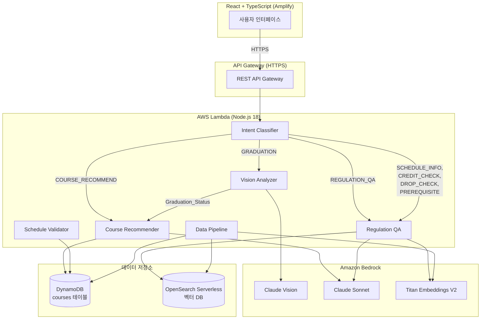
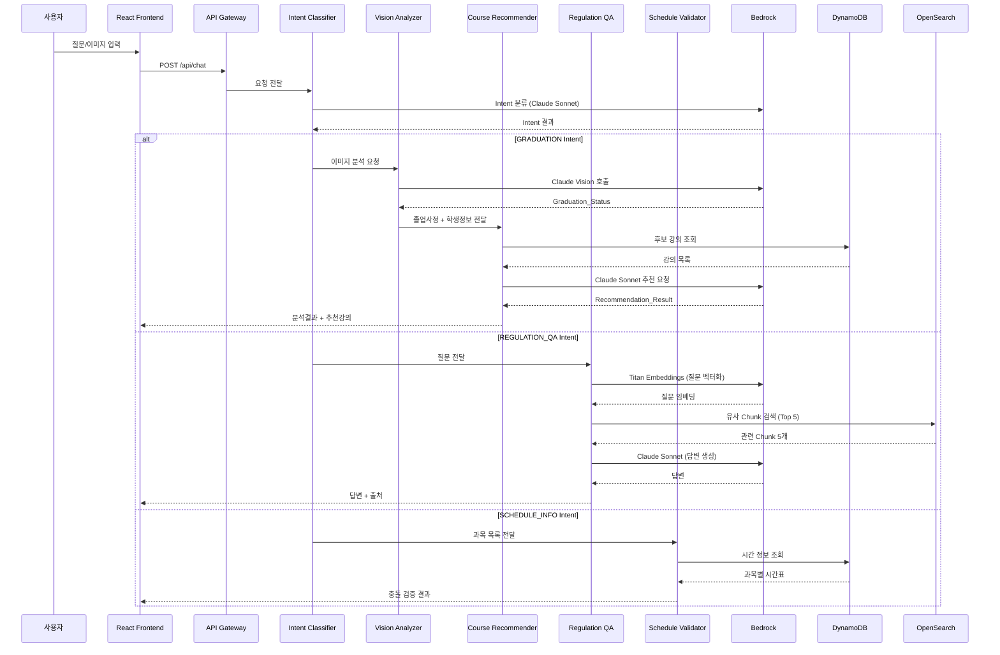
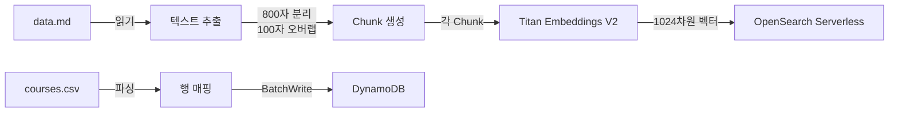
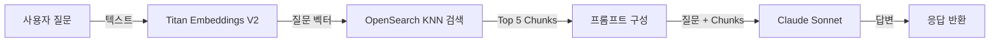

# 설계 문서: 한양대 수강신청 AI Agent

## Overview

한양대 수강신청 AI Agent는 학생의 졸업사정 이미지를 분석하고, 에브리타임 강의평 데이터를 기반으로 최적의 강의를 추천하며, 학사 규정 Q&A를 제공하는 서버리스 AI 시스템이다.

시스템은 크게 6개의 핵심 모듈로 구성된다:
1. **Intent Classifier** — 사용자 입력을 7개 Intent로 분류하여 적절한 모듈로 라우팅
2. **Vision Analyzer** — Bedrock Claude Vision으로 졸업사정 이미지를 분석하여 구조화된 데이터 추출
3. **Course Recommender** — Bedrock Claude Sonnet + DynamoDB 강의 데이터로 최적 강의 전공3개 , 교양 3개 추천
4. **Regulation QA** — Titan Embeddings + OpenSearch + Claude Sonnet 기반 RAG 파이프라인으로 학사 규정 질의응답
5. **Schedule Validator** — 희망 과목 간 시간표 충돌 검증 및 최적 조합 추천
6. **Data Pipeline** — courses.csv → DynamoDB, data.md → OpenSearch 벡터 DB 데이터 적재

### 기술 스택

| 계층 | 기술 |
|------|------|
| Frontend | React + TypeScript |
| Backend | AWS Lambda (Node.js 18) |
| DB (강의) | Amazon DynamoDB |
| DB (벡터) | Amazon OpenSearch Serverless |
| AI (이미지) | Bedrock Claude 3.5 Sonnet Vision |
| AI (추천/QA/Intent) | Bedrock Claude Sonnet |
| AI (임베딩) | Bedrock Titan Embeddings V2 |
| 배포 | AWS Amplify |
| 인프라 | AWS CDK (TypeScript) |

---

## Architecture

### 전체 시스템 아키텍처



### 요청 처리 흐름



### Lambda 함수 구조

단일 Lambda 함수 내에서 Intent에 따라 핸들러를 분기하는 모놀리식 Lambda 패턴을 채택한다. 이유:
- 콜드 스타트 최소화 (함수 수 감소)
- 모듈 간 데이터 공유 용이 (Graduation → Recommend 흐름)
- CDK 인프라 단순화

```
lambda/
├── index.ts                  # 메인 핸들러 (라우터)
├── modules/
│   ├── intentClassifier.ts   # Intent 분류
│   ├── visionAnalyzer.ts     # 졸업사정 이미지 분석
│   ├── courseRecommender.ts  # 강의 추천
│   ├── regulationQA.ts       # 학사 규정 RAG Q&A
│   └── scheduleValidator.ts  # 시간표 충돌 검증
├── services/
│   ├── bedrock.ts            # Bedrock API 클라이언트
│   ├── dynamodb.ts           # DynamoDB 클라이언트
│   └── opensearch.ts         # OpenSearch 클라이언트
├── types/
│   └── index.ts              # 공통 타입 정의
└── utils/
    └── prompt.ts             # 프롬프트 템플릿
```

---

## Components and Interfaces

### 1. Intent Classifier

사용자 입력을 분석하여 7개 Intent 중 하나로 분류한다.

```typescript
// Intent 타입 정의
type Intent = 
  | 'GRADUATION'
  | 'COURSE_RECOMMEND'
  | 'SCHEDULE_INFO'
  | 'CREDIT_CHECK'
  | 'DROP_CHECK'
  | 'PREREQUISITE'
  | 'REGULATION_QA';

interface ClassifyResult {
  intent: Intent;
  confidence: number;
  extractedEntities: {
    courseNames?: string[];
    major?: string;
    year?: number;
  };
}

// Intent Classifier 인터페이스
async function classifyIntent(
  userMessage: string,
  hasImage: boolean
): Promise<ClassifyResult>;
```

**분류 로직:**
- 이미지가 첨부된 경우 → `GRADUATION` 우선 분류
- 텍스트만 있는 경우 → Claude Sonnet으로 Intent 분류
- 분류 불가 시 → `REGULATION_QA` 폴백

### 2. Vision Analyzer

```typescript
interface GraduationStatus {
  summary: {
    totalRequiredCredits: number;
    earnedCredits: number;
    remainingCredits: number;
  };
  areas: Array<{
    areaName: string;
    requiredCredits: number;
    earnedCredits: number;
    status: '충족' | '미충족';
  }>;
  completedCourses: Array<{
    courseName: string;
    credits: number;
    grade: string;
    area: string;
  }>;
  incompleteCourses: Array<{
    courseName: string;
    credits: number;
    area: string;
    reason: string;
  }>;
}

async function analyzeGraduationImage(
  imageBase64: string,
  mediaType: string
): Promise<GraduationStatus>;
```

### 3. Course Recommender

```typescript
interface StudentProfile {
  major: string;
  year: number;
  interests: string;
}

interface CourseRecommendation {
  courseName: string;
  professor: string;
  credits: number;
  rating: number;
  reviewCount: number;
  reason: string; // 2문장 이내
}

interface RecommendationResult {
  recommendations: CourseRecommendation[]; // 3개
  graduationSummary: string;
}

async function recommendCourses(
  graduationStatus: GraduationStatus,
  studentProfile: StudentProfile,
  candidateCourses: Course[]
): Promise<RecommendationResult>;
```

### 4. Regulation QA (RAG)

```typescript
interface RAGResponse {
  answer: string;
  sources: Array<{
    chunkId: string;
    text: string;
    score: number;
  }>;
}

async function answerRegulationQuestion(
  question: string
): Promise<RAGResponse>;

// 내부 함수
async function generateEmbedding(text: string): Promise<number[]>;
async function searchSimilarChunks(embedding: number[], topK: number): Promise<Chunk[]>;
async function generateAnswer(question: string, chunks: Chunk[]): Promise<string>;
```

### 5. Schedule Validator

```typescript
interface ScheduleSlot {
  day: '월' | '화' | '수' | '목' | '금';
  period: number; // 1~9교시
}

interface ConflictResult {
  hasConflict: boolean;
  conflicts: Array<{
    course1: string;
    course2: string;
    overlappingSlots: ScheduleSlot[];
  }>;
  suggestion?: string[];  // 충돌 없는 최적 조합
  timetable: ScheduleSlot[][]; // 시각화용 격자 데이터
}

async function validateSchedule(
  courseNames: string[]
): Promise<ConflictResult>;
```

### 6. API 엔드포인트 명세

#### POST /api/chat

메인 채팅 엔드포인트. 모든 사용자 요청을 처리한다.

**Request:**
```json
{
  "message": "졸업까지 뭐가 부족한지 알려줘",
  "image": "base64_encoded_string (optional)",
  "mediaType": "image/png (optional)",
  "studentProfile": {
    "major": "융합전자공학부",
    "year": 3,
    "interests": "반도체, AI"
  },
  "sessionId": "uuid-string"
}
```

**Response (GRADUATION Intent):**
```json
{
  "intent": "GRADUATION",
  "graduationStatus": {
    "summary": {
      "totalRequiredCredits": 130,
      "earnedCredits": 95,
      "remainingCredits": 35
    },
    "areas": [
      {
        "areaName": "전공필수",
        "requiredCredits": 30,
        "earnedCredits": 24,
        "status": "미충족"
      }
    ],
    "completedCourses": [...],
    "incompleteCourses": [...]
  },
  "recommendations": [
    {
      "courseName": "회로이론",
      "professor": "고광철",
      "credits": 3,
      "rating": 4.74,
      "reviewCount": 42,
      "reason": "졸업 필수 미이수 과목이며, 에브리타임 평점 4.74로 학생 만족도가 매우 높습니다."
    }
  ]
}
```

**Response (REGULATION_QA Intent):**
```json
{
  "intent": "REGULATION_QA",
  "answer": "2026-1학기 수강신청 일정은 다음과 같습니다...",
  "sources": [
    {
      "chunkId": "chunk_042",
      "text": "수강신청 기간: 2026년 2월 24일(월) ~ 2월 26일(수)...",
      "score": 0.92
    }
  ]
}
```

**Response (SCHEDULE_INFO Intent):**
```json
{
  "intent": "SCHEDULE_INFO",
  "hasConflict": true,
  "conflicts": [
    {
      "course1": "회로이론",
      "course2": "전자기학",
      "overlappingSlots": [{"day": "월", "period": 3}]
    }
  ],
  "suggestion": ["회로이론", "생체구조및기능1", "운영체제"],
  "timetable": [...]
}
```

#### POST /api/data/load

데이터 적재 파이프라인 트리거 엔드포인트 (관리자용).

**Request:**
```json
{
  "target": "courses" | "regulations" | "all"
}
```

**Response:**
```json
{
  "status": "success",
  "coursesLoaded": 150,
  "chunksIndexed": 45,
  "errors": []
}
```

---

## Data Models

### DynamoDB: courses 테이블

**테이블 설계:**
## DynamoDB 테이블 구조

### 1. lectures 테이블 (에브리타임 강의 평가) — 5,208행
| 컬럼명 | 타입 | 설명 |
|--------|------|------|
| id | String (PK) | 강의 고유 ID |
| 과목명 | String | 강의명 |
| 교수명 | String | 담당 교수 |
| 캠퍼스 | String | 서울/ERICA |
| 평점 | Number | 전체 평점 (0~5) |
| 평가수 | Number | 평가 개수 |
| 과제 | String | 과제 난이도 |
| 조모임 | String | 조모임 여부 |
| 성적 | String | 성적 난이도 |
| 출결 | String | 출결 방식 |
| 시험횟수 | String | 시험 횟수 |
| 강의평_수강시기 | String | 수강 학기 |
| 강의평_별점 | Number | 강의평 별점 |
| 강의평_추천수 | Number | 추천 수 |
| 강의평_내용 | String | 강의평 텍스트 |

### 2. hanyang_sugang 테이블 (학교 공식 수강편람) — 2,300행
| 컬럼명 | 타입 | 설명 |
|--------|------|------|
| 수업번호 | String (PK) | 강의 고유 번호 |
| 학수번호 | String | 학수 번호 |
| 교과목명 | String | 강의명 |
| 교강사 | String | 담당 교수 |
| 학점 | Number | 강의 학점 |
| 이수구분 | String | 전공필수/선택 등 |
| 이수단위 | String | 100~400단위 |
| 영역 | String | 이수 영역 |
| 학년 | Number | 권장 학년 |
| 강좌유형 | String | 일반/온라인 등 |
| 수업시간 | String | 요일 및 시간 |
| 강의실 | String | 강의실 위치 |
| 수강/정원 | String | 현재수강/정원 |
| 수업형태 | String | 수업 형태 |
| 설강학과 | String | 개설 학과 |
| 공학인증구분 | String | 공학인증 여부 |

### 3. board 테이블 (에브리타임 게시판) — 780행
| 컬럼명 | 타입 | 설명 |
|--------|------|------|
| 번호 | String (PK) | 게시글 번호 |
| 제목 | String | 게시글 제목 |
| 작성자 | String | 작성자 (익명) |
| 작성일 | String | 작성 날짜 |
| 본문 | String | 게시글 내용 |
| 댓글작성자 | String | 댓글 작성자 |
| 댓글내용 | String | 댓글 내용 |

### 4. tips 테이블 (에브리타임 꿀팁 게시판) — 929행
| 컬럼명 | 타입 | 설명 |
|--------|------|------|
| 번호 | String (PK) | 게시글 번호 |
| 제목 | String | 게시글 제목 |
| 작성자 | String | 작성자 (익명) |
| 작성일 | String | 작성 날짜 |
| 본문 | String | 게시글 내용 |
| 댓글작성자 | String | 댓글 작성자 |
| 댓글내용 | String | 댓글 내용 |

## Bedrock 추천 시 활용 전략
- lectures + hanyang_sugang → JOIN 기준: 교과목명 + 교수명
- board + tips → RAG용 벡터 DB 적재 (학사 꿀팁 검색)
- 강의 추천 우선순위: 평점 높음 + 졸업요건 충족 + 시간 충돌 없음
```

---

## 테이블 연결 구조
```
hanyang_sugang (공식 수강편람)
    ↕ 교과목명 + 교수명으로 JOIN
lectures (에브리타임 강의평)
    → Bedrock이 종합해서 추천

board + tips (게시판 꿀팁)
    → 벡터 DB 적재 → RAG 검색
**reviews 항목 구조:**
```json
{
  "semester": "25년 2학기 수강자",
  "rating": 5,
  "recommendation": "추천",
  "content": "교수님 유머가 제스타일이에요..."
}
```

**GSI (Global Secondary Index):**

1. **courseName-index**: courseName(PK) — 과목명으로 빠른 조회
2. **rating-index**: campus(PK) + rating(SK) — 캠퍼스별 평점순 조회

**용량 설계:**
- lectures.csv 기준 약 150개 고유 과목, 각 과목당 평균 10개 강의평
- 항목당 평균 크기: ~2KB
- 총 예상 용량: ~300KB (DynamoDB 온디맨드 모드 적합)

### OpenSearch Serverless: regulations 인덱스

**인덱스 매핑:**
```json
{
  "mappings": {
    "properties": {
      "chunkId": { "type": "keyword" },
      "text": { "type": "text" },
      "embedding": {
        "type": "knn_vector",
        "dimension": 1024,
        "method": {
          "name": "hnsw",
          "space_type": "cosinesimil",
          "engine": "nmslib"
        }
      },
      "source": { "type": "keyword" },
      "chunkIndex": { "type": "integer" }
    }
  }
}
```

**Chunk 분리 전략:**
- data.md를 800자 단위로 분리
- 인접 Chunk 간 100자 오버랩 (문맥 유지)
- 각 Chunk에 소스 파일명과 순서 인덱스 메타데이터 부여

**임베딩 모델:**
- Amazon Bedrock Titan Embeddings V2 (`amazon.titan-embed-text-v2:0`)
- 벡터 차원: 1024
- 유사도 측정: 코사인 유사도

---

## Bedrock 프롬프트 설계

### 1. Intent Classifier 프롬프트

```
당신은 한양대학교 수강신청 AI 어시스턴트의 Intent 분류기입니다.
사용자의 입력을 분석하여 아래 7개 Intent 중 하나로 분류하세요.

[Intent 목록]
- GRADUATION: 졸업사정 분석, 졸업 요건 확인 (이미지 첨부 시 우선)
- COURSE_RECOMMEND: 강의 추천, 수업 추천, 꿀강 추천
- SCHEDULE_INFO: 시간표 확인, 시간 충돌 검사
- CREDIT_CHECK: 학점 확인, 이수 학점, 학점 상한/하한
- DROP_CHECK: 수강 포기, 드랍, 철회
- PREREQUISITE: 선수과목, 후수과목, 수강 조건
- REGULATION_QA: 학사 규정, 수강신청 일정, 폐강 기준 등 일반 학사 질문

[규칙]
1. 이미지가 첨부된 경우 GRADUATION을 우선 분류
2. 분류가 불확실한 경우 REGULATION_QA로 폴백
3. 반드시 JSON 형식으로 응답: {"intent": "INTENT_NAME", "confidence": 0.95}

[사용자 입력]
{userMessage}
```

### 2. Vision Analyzer 프롬프트

```
이 이미지는 한양대학교 졸업사정 결과표입니다.
아래 항목을 JSON 형식으로 정확히 추출해주세요.

반드시 아래 JSON 구조로만 응답하세요 (다른 텍스트 없이):
{
  "summary": {
    "totalRequiredCredits": <졸업 필요 총 학점>,
    "earnedCredits": <현재 취득 학점>,
    "remainingCredits": <남은 학점>
  },
  "areas": [
    {
      "areaName": "<영역명>",
      "requiredCredits": <필요학점>,
      "earnedCredits": <취득학점>,
      "status": "충족" 또는 "미충족"
    }
  ],
  "completedCourses": [
    {"courseName": "<과목명>", "credits": <학점>, "grade": "<성적>", "area": "<영역>"}
  ],
  "incompleteCourses": [
    {"courseName": "<과목명>", "credits": <학점>, "area": "<영역>", "reason": "<사유>"}
  ]
}

이미지에서 읽을 수 없는 항목은 null로 표시하세요.
```

### 3. Course Recommender 프롬프트

```
당신은 한양대학교 수강신청 AI 추천 전문가입니다.
아래 정보를 종합하여 학생에게 최적의 강의 3개를 추천하세요.

[학생 정보]
- 전공: {major}
- 학년: {year}학년
- 관심분야: {interests}

[졸업사정 분석 결과]
{graduationStatusJSON}

[후보 강의 목록 (에브리타임 평점 3.0 이상)]
{candidateCoursesJSON}

[추천 규칙]
1. 졸업 필수 미이수 과목을 최우선으로 추천
2. 에브리타임 평점과 강의평을 근거로 추천 이유 작성
3. 각 추천 이유는 2문장 이내로 작성
4. 반드시 JSON 배열로 3개 강의를 응답

[응답 형식]
[
  {
    "courseName": "과목명",
    "professor": "교수명",
    "credits": 3,
    "rating": 4.5,
    "reviewCount": 20,
    "reason": "추천 이유 (2문장 이내)"
  }
]
```

### 4. Regulation QA 프롬프트

```
당신은 한양대학교 학사 규정 전문 상담사입니다.
아래 참고 자료를 기반으로 학생의 질문에 정확하게 답변하세요.

[참고 자료 (학사안내 원문)]
{retrievedChunks}

[규칙]
1. 반드시 참고 자료에 근거하여 답변하세요
2. 참고 자료에 없는 내용은 "해당 정보를 찾을 수 없습니다."로 답변하세요
3. 답변 마지막에 근거 출처를 표시하세요
4. 한국어로 친절하게 답변하세요

[학생 질문]
{question}
```

---

## RAG 파이프라인 상세 설계

### 데이터 적재 흐름 (Ingestion)



### 질의 처리 흐름 (Retrieval + Generation)



### Chunk 분리 알고리즘

```typescript
function splitIntoChunks(text: string, chunkSize: number = 800, overlap: number = 100): Chunk[] {
  const chunks: Chunk[] = [];
  let start = 0;
  let index = 0;

  while (start < text.length) {
    let end = Math.min(start + chunkSize, text.length);
    
    // 문장 경계에서 자르기 (마침표, 줄바꿈 기준)
    if (end < text.length) {
      const lastBreak = text.lastIndexOf('\n', end);
      const lastPeriod = text.lastIndexOf('.', end);
      const breakPoint = Math.max(lastBreak, lastPeriod);
      if (breakPoint > start + chunkSize * 0.5) {
        end = breakPoint + 1;
      }
    }

    chunks.push({
      chunkId: `chunk_${String(index).padStart(3, '0')}`,
      text: text.slice(start, end).trim(),
      source: 'data.md',
      chunkIndex: index,
    });

    start = end - overlap;
    index++;
  }

  return chunks;
}
```

### OpenSearch KNN 검색 쿼리

```json
{
  "size": 5,
  "query": {
    "knn": {
      "embedding": {
        "vector": [0.1, 0.2, ...],
        "k": 5
      }
    }
  },
  "_source": ["chunkId", "text", "source", "chunkIndex"]
}
```

### 재시도 전략

Data Pipeline에서 Titan Embeddings API 호출 실패 시:
- 최대 3회 재시도
- 지수 백오프: 1초 → 2초 → 4초
- 3회 실패 시 해당 Chunk를 에러 로그에 기록하고 건너뜀


---

## Correctness Properties

*A property is a characteristic or behavior that should hold true across all valid executions of a system — essentially, a formal statement about what the system should do. Properties serve as the bridge between human-readable specifications and machine-verifiable correctness guarantees.*

### Property 1: 파일 형식 검증

*For any* 파일 확장자 문자열에 대해, 해당 확장자가 PNG, JPG, JPEG (대소문자 무관) 중 하나이면 검증을 통과하고, 그 외의 모든 확장자는 거부되어야 한다.

**Validates: Requirements 1.2, 1.3**

### Property 2: 파일 크기 검증

*For any* 양의 정수 파일 크기(바이트)에 대해, 10MB(10 * 1024 * 1024 바이트) 이하이면 검증을 통과하고, 초과하면 거부되어야 한다.

**Validates: Requirements 1.4**

### Property 3: 필수 필드 검증

*For any* StudentProfile 입력 조합(major, year, interests)에 대해, 하나라도 빈 문자열이거나 공백만으로 구성된 경우 검증이 실패하고, 모든 필드가 비어있지 않은 경우에만 검증을 통과해야 한다.

**Validates: Requirements 1.5**

### Property 4: Vision 응답 파싱

*For any* 유효한 Graduation_Status JSON 객체에 대해, JSON 문자열로 직렬화한 후 파싱하면 원본 객체와 동일한 summary, areas, completedCourses, incompleteCourses 필드를 포함해야 한다.

**Validates: Requirements 2.2**

### Property 5: 강의 후보 필터링

*For any* 강의 목록과 전공/미이수 영역 조건에 대해, 필터링된 후보 강의 목록의 모든 강의는 에브리타임 평점이 3.0 이상이어야 한다.

**Validates: Requirements 3.2, 3.3**

### Property 6: 추천 결과 구조 검증

*For any* 유효한 Graduation_Status와 StudentProfile, 비어있지 않은 후보 강의 목록에 대해, Course_Recommender의 응답을 파싱하면 정확히 3개의 추천 강의가 반환되고, 각 추천 강의에는 courseName, professor, credits, rating, reason 필드가 모두 존재해야 한다.

**Validates: Requirements 4.1, 4.3**

### Property 7: 추천 프롬프트 구성 완전성

*For any* Graduation_Status, StudentProfile, 후보 강의 목록에 대해, 구성된 프롬프트 문자열에는 학생의 전공, 학년, 관심분야, 졸업사정 요약, 후보 강의 정보가 모두 포함되어야 한다.

**Validates: Requirements 4.2**

### Property 8: Intent 분류 결과 유효성

*For any* 사용자 입력 텍스트와 이미지 첨부 여부에 대해, Intent Classifier의 분류 결과는 반드시 GRADUATION, COURSE_RECOMMEND, SCHEDULE_INFO, CREDIT_CHECK, DROP_CHECK, PREREQUISITE, REGULATION_QA 중 하나여야 한다.

**Validates: Requirements 8.1**

### Property 9: Intent 라우팅 정확성

*For any* 유효한 Intent 값에 대해, GRADUATION은 Vision_Analyzer를, COURSE_RECOMMEND는 Course_Recommender를, SCHEDULE_INFO/CREDIT_CHECK/DROP_CHECK/PREREQUISITE/REGULATION_QA는 Regulation_QA 모듈을 호출해야 한다.

**Validates: Requirements 8.2, 8.3, 8.4, 8.5**

### Property 10: Chunk 분리 크기 제한

*For any* 텍스트 문자열에 대해, 800자 단위로 분리된 모든 Chunk의 길이는 800자 이하여야 하며, 원본 텍스트의 모든 내용이 하나 이상의 Chunk에 포함되어야 한다.

**Validates: Requirements 9.1, 11.3**

### Property 11: RAG 검색 결과 제한 및 프롬프트 포함

*For any* 질문 임베딩 벡터에 대해, OpenSearch 검색 결과는 최대 5개이며, 검색된 모든 Chunk 텍스트가 Claude Sonnet에 전달되는 프롬프트에 포함되어야 한다.

**Validates: Requirements 9.4, 9.5**

### Property 12: RAG 답변 출처 포함

*For any* RAG 응답에 대해, 답변과 함께 반환되는 sources 배열에는 최소 1개의 Chunk 출처 정보(chunkId, text, score)가 포함되어야 한다.

**Validates: Requirements 9.8**

### Property 13: RAG 검색 일관성 (라운드트립)

*For any* 동일한 질문 텍스트에 대해, 임베딩을 생성하고 OpenSearch에서 검색한 결과의 Chunk ID 목록은 동일한 질문을 다시 처리했을 때와 동일해야 한다.

**Validates: Requirements 9.11**

### Property 14: 시간표 충돌 검사 정확성

*For any* 과목 목록과 각 과목의 시간표 슬롯(요일, 교시)에 대해, 두 과목이 동일한 (요일, 교시) 슬롯을 공유하면 충돌로 감지되어야 하고, 공유하는 슬롯이 없으면 충돌이 없어야 한다.

**Validates: Requirements 10.2, 10.3**

### Property 15: 충돌 없는 조합 추천 검증

*For any* Schedule_Validator가 추천한 과목 조합에 대해, 해당 조합 내의 모든 과목 쌍은 시간 충돌이 없어야 한다.

**Validates: Requirements 10.4**

### Property 16: CSV 적재 라운드트립

*For any* 유효한 CSV 행(강의명, 교수명, 평점 등 필수 필드 포함)에 대해, DynamoDB에 적재한 후 해당 ID로 조회하면 원본 CSV 행의 모든 필드 값과 동일한 값이 반환되어야 한다.

**Validates: Requirements 11.1, 11.2, 11.9**

### Property 17: 잘못된 CSV 행 건너뛰기

*For any* CSV 데이터(유효한 행과 잘못된 행이 혼합된)에 대해, 파이프라인 실행 후 유효한 행만 DynamoDB에 적재되고, 잘못된 행은 건너뛰어져야 한다.

**Validates: Requirements 11.6**

### Property 18: 임베딩 API 재시도

*For any* Titan Embeddings API 호출 실패에 대해, 최대 3회까지 재시도하며, 3회 모두 실패한 경우에만 해당 Chunk를 건너뛰어야 한다.

**Validates: Requirements 11.8**

### Property 19: Chunk 벡터 검색 라운드트립

*For any* OpenSearch에 저장된 Chunk에 대해, 해당 Chunk의 원본 텍스트로 임베딩을 생성하여 유사도 검색하면 해당 Chunk가 상위 5개 결과에 포함되어야 한다.

**Validates: Requirements 11.10**

### Property 20: 결과 카드 렌더링 완전성

*For any* CourseRecommendation 객체에 대해, 렌더링된 카드 컴포넌트에는 강의명, 교수명, 학점, 에브리타임 평점, 추천 이유가 모두 표시되어야 하며, 졸업 영역의 충족 상태에 따라 초록색(충족) 또는 빨간색(미충족) 스타일이 적용되어야 한다.

**Validates: Requirements 5.2, 5.4**

---

## Error Handling

### 에러 분류 및 처리 전략

| 에러 유형 | 원인 | 처리 방식 | 사용자 메시지 |
|-----------|------|-----------|---------------|
| 입력 검증 실패 | 잘못된 파일 형식/크기, 필수 필드 누락 | 즉시 반환, API 호출 없음 | 구체적 검증 실패 메시지 |
| Bedrock Vision API 실패 | 네트워크 오류, 서비스 장애 | 1회 재시도 후 에러 반환 | "졸업사정 분석에 실패했습니다. 잠시 후 다시 시도해주세요." |
| Bedrock Sonnet API 실패 | 네트워크 오류, 서비스 장애 | 1회 재시도 후 에러 반환 | "강의 추천에 실패했습니다. 잠시 후 다시 시도해주세요." |
| Titan Embeddings API 실패 | 네트워크 오류, 서비스 장애 | 3회 재시도 (지수 백오프) | "학사 규정 검색에 실패했습니다. 잠시 후 다시 시도해주세요." |
| 이미지 인식 실패 | 불선명한 이미지, 비졸업사정 이미지 | 즉시 에러 반환 | "졸업사정 정보를 인식할 수 없습니다. 선명한 이미지를 업로드해주세요." |
| DynamoDB 조회 0건 | 조건에 맞는 강의 없음 | 조건 완화 안내 | "조건에 맞는 강의 데이터가 없습니다." |
| OpenSearch 검색 실패 | 인덱스 미존재, 연결 오류 | 에러 반환 | "학사 규정 검색에 실패했습니다." |
| Lambda 타임아웃 | 29초 초과 | 타임아웃 에러 반환 | "요청 처리 시간이 초과되었습니다. 잠시 후 다시 시도해주세요." |
| JSON 파싱 실패 | Bedrock 응답 형식 오류 | 재시도 1회 후 에러 반환 | "응답 처리에 실패했습니다. 다시 시도해주세요." |

### 에러 응답 형식

```typescript
interface ErrorResponse {
  statusCode: number;  // 400, 422, 500, 504
  error: {
    code: string;      // VALIDATION_ERROR, VISION_FAILED, etc.
    message: string;   // 사용자 친화적 메시지
    details?: string;  // 디버깅용 상세 정보 (개발 환경만)
  };
}
```

### 재시도 전략

```typescript
async function withRetry<T>(
  fn: () => Promise<T>,
  maxRetries: number = 3,
  baseDelay: number = 1000
): Promise<T> {
  for (let attempt = 0; attempt <= maxRetries; attempt++) {
    try {
      return await fn();
    } catch (error) {
      if (attempt === maxRetries) throw error;
      await new Promise(r => setTimeout(r, baseDelay * Math.pow(2, attempt)));
    }
  }
  throw new Error('Unreachable');
}
```

---

## Testing Strategy

### 테스트 프레임워크

| 계층 | 프레임워크 | 용도 |
|------|-----------|------|
| 단위 테스트 | Vitest | Lambda 모듈별 단위 테스트 |
| Property 테스트 | fast-check + Vitest | Correctness Properties 검증 |
| 컴포넌트 테스트 | React Testing Library + Vitest | React 컴포넌트 테스트 |
| 통합 테스트 | Vitest + AWS SDK Mock | API 엔드포인트 통합 테스트 |

### Property-Based Testing 설정

- 라이브러리: **fast-check** (TypeScript 네이티브 지원)
- 각 property 테스트는 최소 **100회 반복** 실행
- 각 테스트에 설계 문서의 Property 번호를 태그로 명시

**태그 형식:**
```typescript
// Feature: hanyang-course-registration-agent, Property 1: 파일 형식 검증
```

### 단위 테스트 범위

단위 테스트는 다음에 집중한다:
- 특정 입력에 대한 구체적 예시 검증 (예: PNG 파일 업로드 성공)
- 에지 케이스 (예: 빈 CSV, 존재하지 않는 파일)
- API 실패 시 에러 핸들링 (모킹 기반)
- 모듈 간 통합 포인트

### Property 테스트 범위

Property 테스트는 다음에 집중한다:
- 입력 검증 로직 (파일 형식, 크기, 필수 필드)
- 데이터 변환 로직 (CSV 파싱, Chunk 분리, JSON 파싱)
- 필터링 로직 (평점 필터, Intent 라우팅)
- 라운드트립 속성 (CSV 적재/조회, Chunk 저장/검색)
- 시간표 충돌 검사 알고리즘

### 테스트 구조

```
tests/
├── unit/
│   ├── intentClassifier.test.ts
│   ├── visionAnalyzer.test.ts
│   ├── courseRecommender.test.ts
│   ├── regulationQA.test.ts
│   ├── scheduleValidator.test.ts
│   └── dataPipeline.test.ts
├── property/
│   ├── validation.property.test.ts      # Property 1, 2, 3
│   ├── parsing.property.test.ts         # Property 4, 10
│   ├── filtering.property.test.ts       # Property 5, 6, 7
│   ├── intent.property.test.ts          # Property 8, 9
│   ├── rag.property.test.ts             # Property 11, 12, 13, 19
│   ├── schedule.property.test.ts        # Property 14, 15
│   ├── pipeline.property.test.ts        # Property 16, 17, 18
│   └── rendering.property.test.ts       # Property 20
└── integration/
    ├── chatEndpoint.test.ts
    └── dataLoadEndpoint.test.ts
```

### 각 Correctness Property의 테스트 매핑

| Property | 테스트 파일 | 테스트 유형 |
|----------|-----------|------------|
| Property 1: 파일 형식 검증 | validation.property.test.ts | fast-check |
| Property 2: 파일 크기 검증 | validation.property.test.ts | fast-check |
| Property 3: 필수 필드 검증 | validation.property.test.ts | fast-check |
| Property 4: Vision 응답 파싱 | parsing.property.test.ts | fast-check |
| Property 5: 강의 후보 필터링 | filtering.property.test.ts | fast-check |
| Property 6: 추천 결과 구조 검증 | filtering.property.test.ts | fast-check |
| Property 7: 추천 프롬프트 구성 | filtering.property.test.ts | fast-check |
| Property 8: Intent 분류 유효성 | intent.property.test.ts | fast-check |
| Property 9: Intent 라우팅 정확성 | intent.property.test.ts | fast-check |
| Property 10: Chunk 분리 크기 제한 | parsing.property.test.ts | fast-check |
| Property 11: RAG 검색 및 프롬프트 | rag.property.test.ts | fast-check |
| Property 12: RAG 답변 출처 포함 | rag.property.test.ts | fast-check |
| Property 13: RAG 검색 일관성 | rag.property.test.ts | fast-check |
| Property 14: 시간표 충돌 검사 | schedule.property.test.ts | fast-check |
| Property 15: 충돌 없는 조합 검증 | schedule.property.test.ts | fast-check |
| Property 16: CSV 적재 라운드트립 | pipeline.property.test.ts | fast-check |
| Property 17: 잘못된 CSV 행 건너뛰기 | pipeline.property.test.ts | fast-check |
| Property 18: 임베딩 API 재시도 | pipeline.property.test.ts | fast-check |
| Property 19: Chunk 벡터 검색 라운드트립 | rag.property.test.ts | fast-check |
| Property 20: 결과 카드 렌더링 | rendering.property.test.ts | fast-check |

## 수강신청 난이도 계산 로직
difficulty_score 계산:
  경쟁률 = (수강 / 정원) × 100   [hanyang_sugang]
  인기도 = 평가수 정규화 (0~1)    [lectures]
  선호도 = 강의평_별점 평균 (0~1) [lectures]
  
  난이도 점수 = (경쟁률 × 0.4) +
               (인기도 × 0.3) +
               (선호도 × 0.3)
  
  상 (80점 이상): 수강신청 매우 어려움
  중 (50~79점):  수강신청 보통
  하 (50점 미만): 수강신청 비교적 쉬움

## API 명세

POST /api/analyze-graduation
  요청: { image: base64 }
  응답: {
    이수완료: [...],
    미이수: [...],
    취득학점: number,
    부족학점: number,
    영역별현황: {...}
  }

POST /api/recommend
  요청: {
    전공: string,
    학년: number,
    관심분야: string,
    공강요일: string[],   ← 공강 지정
    공강시간: string[],   ← 공강 시간대
    졸업사정: object
  }
  응답: {
    planA: { courses: [...], reason: string },
    planB: { courses: [...], reason: string },
    planC: { courses: [...], reason: string }
  }

POST /api/ask-regulation
  요청: { question: string }
  응답: { answer: string, source_pages: number[] }

POST /api/check-conflict
  요청: { courses: string[] }
  응답: {
    hasConflict: boolean,
    conflicts: [...],
    suggestions: [...]
  }

## OpenSearch 벡터 DB
- 인덱스: regulations (학사안내 원문)
- 인덱스: community (board + tips 게시판)
- 청크 크기: 800자 / 오버랩: 200자
- 임베딩: Bedrock Titan Embeddings
